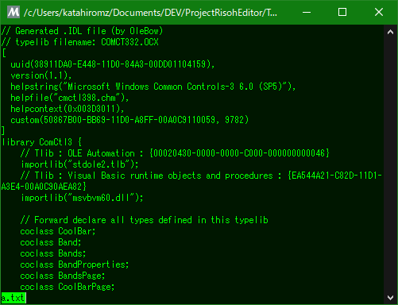

# OleBow by katahiromz

The OleView replacement in plain C++11/Win32.

This software is based on [leibnitz27/olewoo](https://github.com/leibnitz27/olewoo).



## Usage

```txt
olebow32 [options] your_file.tlb [output.idl]

Options:
  --help      Show this message
  --version   Show version information
  --codepage XXX  Set codepage
```
